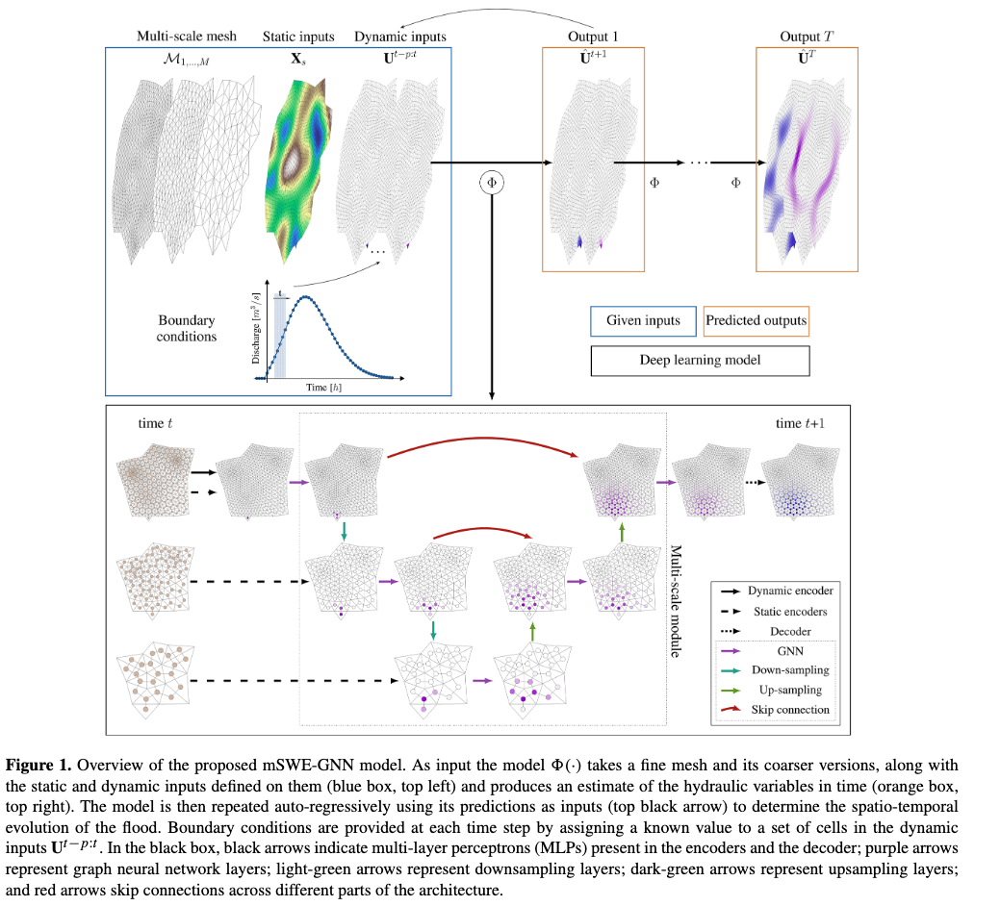

# Summary
- [Bentivoglio et al. (2025)](https://doi.org/10.5194/nhess-25-335-2025) proposes multi-scale SWE-GNN (nSWE-GNN), an extended work upon improvement over [[Bentivoglio-SWE-GNN.md|SWE-GNN]].

# Multi-scale mesh creation
- They have created multi-scale mesh coarse to finer using iterative process.
- MeshKernel software

## Multi-scale graph
- The multiscale graph is in following sense: There are multiple GNN layers. First, message passing happens at fine scale in Layer 1. Then, updated node embeddings at fine scale in Layer 1 are downsampled (coarsening) to coarse resolution, and message passing happens at that resolution in GNN layer 2. Similarly, it is further downsampled to desired final coarse resolution. Once final coarse resolution is reached, then upsampling begins to bring graph to orginal fine scale.

- Downsampling  operator is a mean pooling operator from fine mesh to a coarse mesh

- Upsampling operator is a learnable operator

- Skip connections to combine the outputs of the downsampling GNNs with the outputs of the upsampling operations  before applying another GNN layer

- Skip connections are done between same scale graphs to prevent loss of signal. More details on Section 2.1 and Figure 1 of the [paper](https://doi.org/10.5194/nhess-25-335-2025).

<figure>
    
</figure>

# Inputs and outputs
- Static node features: area of cell, elevation, slope, manning coefficient and water level at time step t
- Dynamic node features: flood depth ($h^t_i$) and unit discharge ($|q|^t_i$) at previous time steps
- Edge features: outward unit normal vector ($n_{ij}$) and cell sides' length  ($l_{ij}$)
- Outputs: Water depth and unit discharge at time $t+1$

# Training strategy
- Multi-step-ahead loss function that measure accumulated error over consecutive time steps (K-step rollout)
- Curriculum learning strategy: first learn one-step ahead and then to increase number of steps ahead to stablize the predictions
- Adam Optimization
- Starting LR = 0.003, fixed step decay of 70% every 20 epochs
- Trained for 200 epochs early sopping criteria
- 16 bit mixed precision to decrease computational burgden

# Datasets
- **Dataset generation**: Dike-breach flood simulation using Delft3D
- Irregular mesh polygons
- Multi-scale mesh: 4 scales
- Randomly generated DEM for each scales
- Boundary condition: inflow discharge hydrograph to one random border edge
- 100 simulations (60 training, 20 validation and 20 test) at temporal resolution of 2 hours

> Assessed transferability of trained model to dike ring 15, Lopiker- and Krimpenerwaard in the Netherlands, which surrounds and protects the area between Rotterdam and Utrecht

# Comparison with [[Bentivoglio-SWE-GNN.md|SWE-GNN]]

- mSWE-GNN has more parameters
- Comparatively fast, with speed-up upto **1200** times

